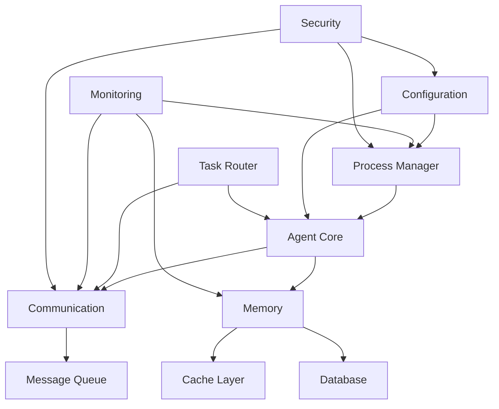

# Key Modules and Critical Success Factors

## Critical Success Factors (Priority Order)

### 1. CLI Process Management (Impact: 30%)
**Why Critical**: This is the foundation of the entire system. Without reliable process spawning and management, no agent can function.

**Key Components**:
- `CLIProcessManager`: Handles spawning, monitoring, and terminating Claude CLI processes
- Process isolation and resource management
- Graceful error recovery and process restart capabilities

**Success Metrics**:
- Process spawn success rate >99.9%
- Zero zombie processes
- <1s spawn time
- Graceful shutdown in 100% of cases

**Architecture Optimization**:
- Process pool pre-warming for faster spawning
- Health check mechanisms with automatic restart
- Resource limits per process to prevent runaway agents
- Circuit breaker pattern for failing processes

### 2. Inter-Agent Communication Protocol (Impact: 25%)
**Why Critical**: Agents must reliably exchange information to collaborate effectively.

**Key Components**:
- Message Queue implementation (Redis/RabbitMQ/Kafka adapters)
- Protocol serialization/deserialization
- Event bus for broadcast communications
- Request-response correlation

**Success Metrics**:
- Message delivery reliability >99.99%
- <10ms message routing latency
- Zero message loss under load
- Proper ordering guarantees

**Architecture Optimization**:
- Pluggable queue backends for different deployment scenarios
- Automatic retry with exponential backoff
- Dead letter queue for failed messages
- Message deduplication and idempotency

### 3. Task Routing and Agent Selection (Impact: 20%)
**Why Critical**: Determines overall system efficiency by matching tasks to the most appropriate agents.

**Key Components**:
- Agent capability registry
- Task type classification
- Load balancing algorithm
- Agent availability tracking

**Success Metrics**:
- Correct agent selection >95% of time
- Even load distribution (variance <20%)
- <50ms routing decision time
- Zero task drops

**Architecture Optimization**:
- ML-based agent selection over time
- Predictive load balancing
- Agent specialization scoring
- Dynamic capability discovery

### 4. Memory and Context Management (Impact: 15%)
**Why Critical**: Enables agents to maintain context and share knowledge effectively.

**Key Components**:
- Short-term memory (Redis)
- Long-term memory (PostgreSQL)
- Context window optimization
- Shared knowledge base

**Success Metrics**:
- Context retrieval <100ms
- Memory utilization <80%
- Relevant context hit rate >90%
- Zero data corruption

**Architecture Optimization**:
- Hierarchical memory with hot/cold tiers
- Semantic search for context retrieval
- Automatic context summarization
- Memory garbage collection

### 5. Configuration and Prompt Management (Impact: 10%)
**Why Critical**: Determines agent behavior and capabilities through configuration.

**Key Components**:
- JSON configuration schema
- Prompt template system
- Dynamic configuration reloading
- Configuration validation

**Success Metrics**:
- Zero configuration errors
- <1s configuration reload time
- 100% backward compatibility
- Clear error messages

**Architecture Optimization**:
- Schema versioning and migration
- Configuration inheritance
- A/B testing for prompts
- Hot reload without restart

## Module Dependency Graph

## Risk Mitigation Strategies

### Process Management Risks
- **Risk**: Process crashes or hangs
- **Mitigation**: Watchdog timers, health checks, automatic restarts
- **Monitoring**: Process metrics, crash logs, resource usage

### Communication Risks
- **Risk**: Message queue failure or network partition
- **Mitigation**: Multiple queue backends, local fallback, message persistence
- **Monitoring**: Queue depth, delivery rates, error rates

### Memory Risks
- **Risk**: Memory leaks or unbounded growth
- **Mitigation**: Memory limits, automatic cleanup, context summarization
- **Monitoring**: Memory usage trends, GC metrics

### Configuration Risks
- **Risk**: Invalid configuration causing system failure
- **Mitigation**: Schema validation, safe defaults, gradual rollout
- **Monitoring**: Configuration change tracking, validation errors

## Architecture Validation

### How Key Modules Ensure Success

1. **Process Manager Reliability**
   - Supervisor pattern ensures process recovery
   - Resource isolation prevents cascade failures
   - Pre-flight checks validate environment

2. **Communication Robustness**
   - Multiple transport options provide flexibility
   - Guaranteed delivery modes for critical messages
   - Async patterns prevent blocking

3. **Intelligent Routing**
   - Capability matching ensures task success
   - Load balancing prevents overload
   - Fallback mechanisms handle failures

4. **Effective Memory Management**
   - Hierarchical storage optimizes access patterns
   - Shared memory enables collaboration
   - Bounded memory prevents resource exhaustion

5. **Flexible Configuration**
   - JSON schema enables tooling support
   - Layered configuration supports customization
   - Validation prevents runtime errors

## Success Indicators

### Early Indicators (First Week)
- All unit tests passing
- Basic agent spawning working
- Simple message exchange functional
- Configuration loading without errors

### Medium-term Indicators (First Month)
- 10+ agents running concurrently
- 1000+ tasks completed successfully
- No memory leaks detected
- <1% error rate

### Long-term Indicators (Three Months)
- 100K+ tasks processed
- 99.9% uptime achieved
- Linear scaling demonstrated
- Production deployment successful

## Optimization Opportunities

### Performance Optimizations
1. Process pool pre-warming
2. Message batching for throughput
3. Cache warming for common queries
4. Connection pooling for databases

### Reliability Optimizations
1. Circuit breakers for external services
2. Bulkheads for fault isolation
3. Retry storms prevention
4. Graceful degradation modes

### Scalability Optimizations
1. Horizontal scaling patterns
2. Sharding strategies
3. Read replicas for memory
4. CDN for static assets

## Conclusion

The architecture is designed to maximize success by:
1. Focusing on reliable process management as the foundation
2. Ensuring robust inter-agent communication
3. Implementing intelligent task routing
4. Providing effective memory management
5. Supporting flexible configuration

Each module is designed with clear interfaces, comprehensive error handling, and monitoring hooks to ensure the system can evolve and scale while maintaining reliability.