# Claude Multi-Agent System Architecture

## System Overview

The Claude Multi-Agent System is designed as a modular, extensible platform for orchestrating multiple AI agents using Claude CLI. The architecture follows a layered approach with clear separation of concerns and well-defined interfaces.

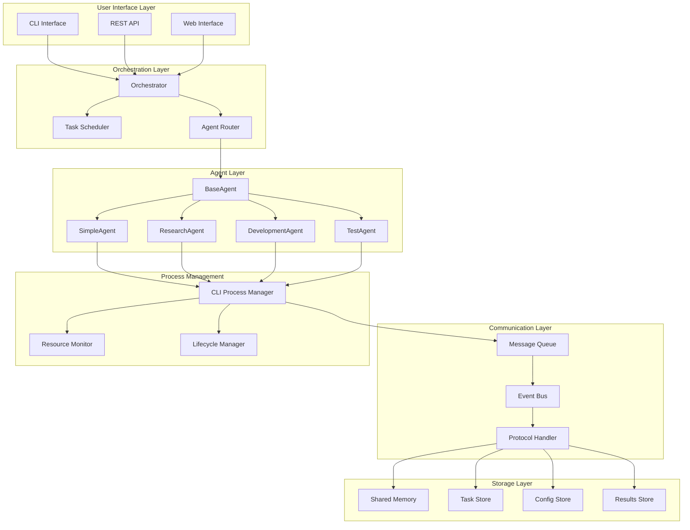

## Component Architecture

### 1. User Interface Layer

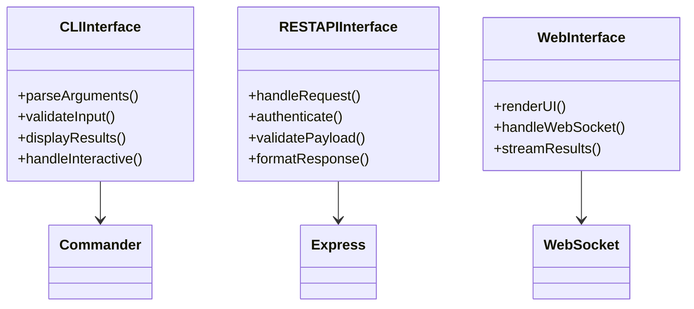

### 2. Agent Architecture

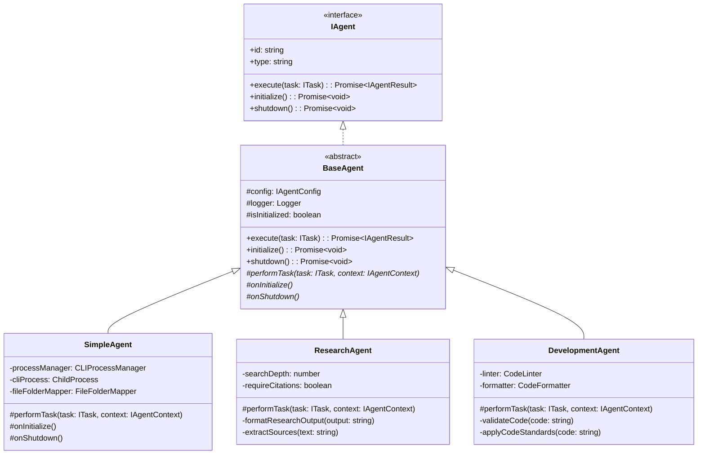

### 3. Process Management

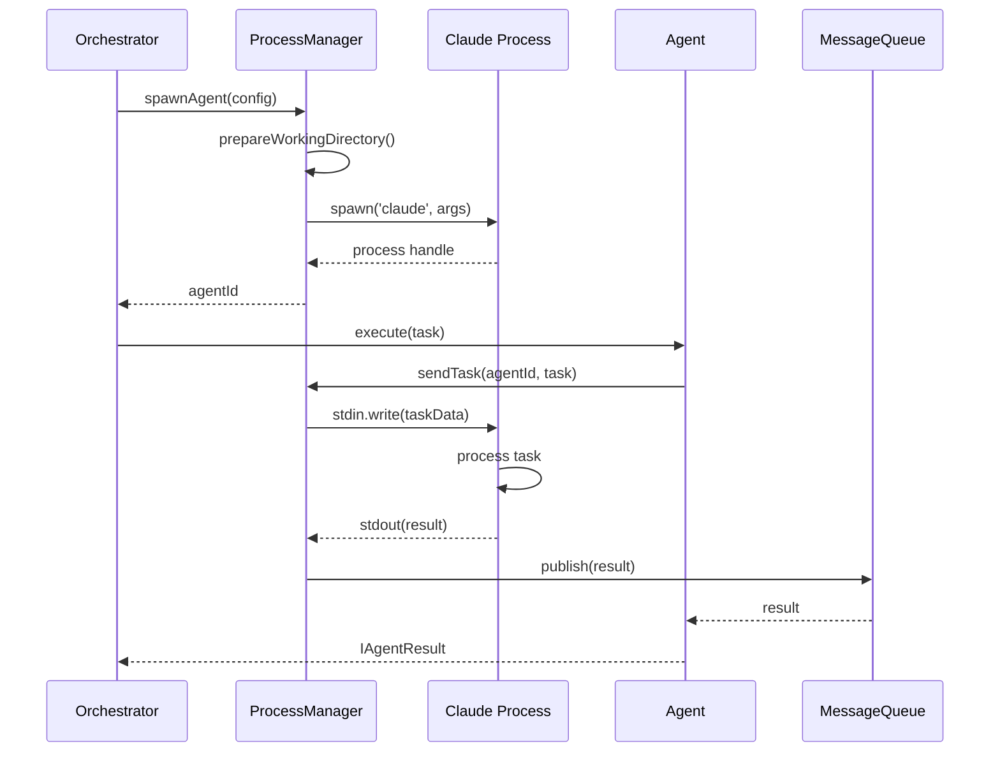

### 4. Communication Flow

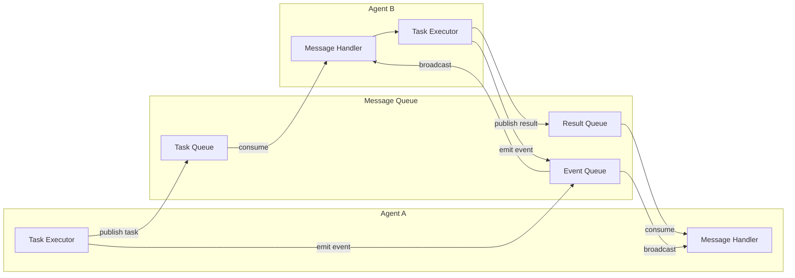

## Data Flow Architecture

### Task Execution Flow

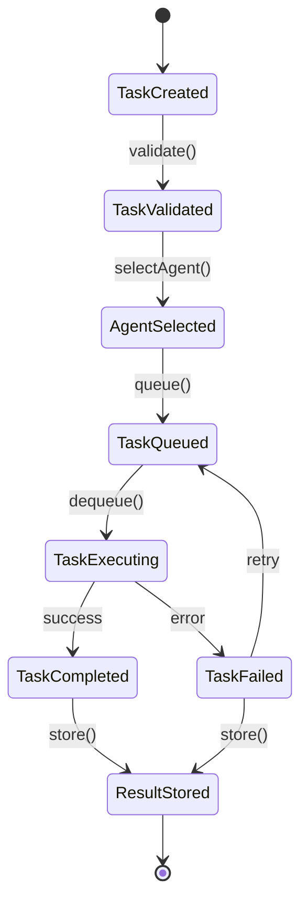

### Memory Management

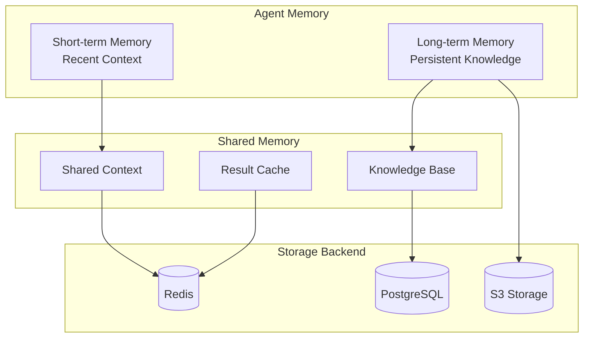

## Deployment Architecture

### Local Development

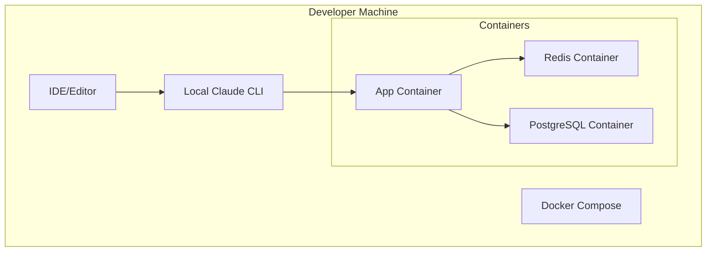

### Production Deployment (AWS)

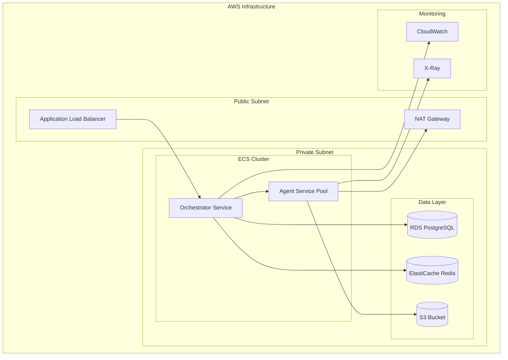

## Security Architecture

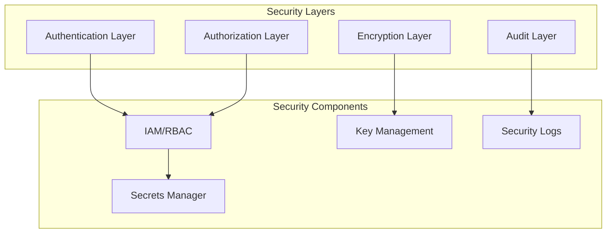

## Scalability Patterns

### Horizontal Scaling

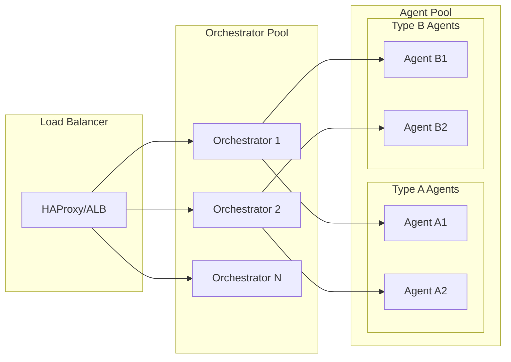

### Queue-Based Scaling

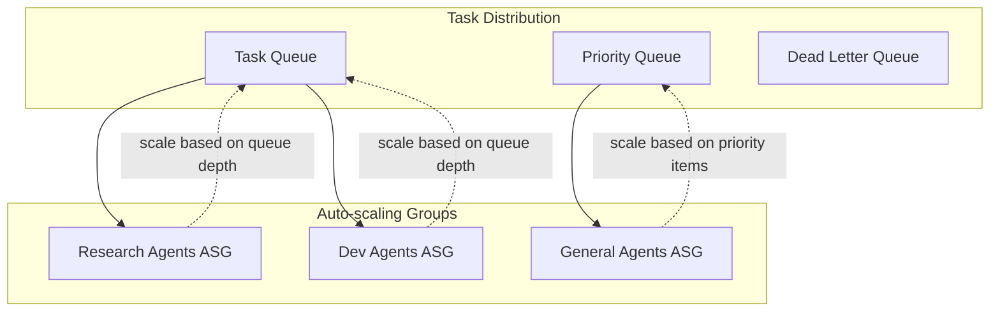

## Technology Stack

### Core Technologies
- **Runtime**: Node.js 18+ (TypeScript)
- **CLI Framework**: Commander.js
- **Process Management**: Child Process, PM2
- **Message Queue**: Redis, RabbitMQ, Kafka (configurable)
- **Storage**: PostgreSQL, Redis, S3
- **Monitoring**: Winston, Prometheus, Grafana
- **Testing**: Jest, Supertest

### Infrastructure
- **Container**: Docker, Kubernetes
- **Cloud**: AWS (EC2, ECS, Lambda)
- **CI/CD**: GitHub Actions, Jenkins
- **Service Mesh**: Istio (optional)

## Key Design Decisions

1. **Agent Isolation**: Each agent runs in its own process for fault isolation
2. **Message-Based Communication**: Loose coupling through message queues
3. **Configuration-Driven**: JSON-based configuration for flexibility
4. **Stateless Agents**: Agents don't maintain state between tasks
5. **Pluggable Architecture**: Easy to add new agent types
6. **Observable System**: Comprehensive logging and monitoring
7. **Security First**: Authentication, authorization, and encryption built-in
8. **Cloud Native**: Designed for containerized deployment

## Performance Characteristics

- **Latency**: <100ms for task routing
- **Throughput**: 1000+ tasks/minute per orchestrator
- **Scalability**: Linear scaling with agent pool size
- **Availability**: 99.9% with proper redundancy
- **Resource Usage**: ~512MB RAM per agent, ~1GB per orchestrator

## Future Architecture Considerations

1. **GraphQL API**: For more flexible client queries
2. **WebAssembly Agents**: For compute-intensive tasks
3. **Edge Deployment**: Agents closer to data sources
4. **Federated Learning**: Agents learning from distributed data
5. **Blockchain Integration**: For audit trail and consensus