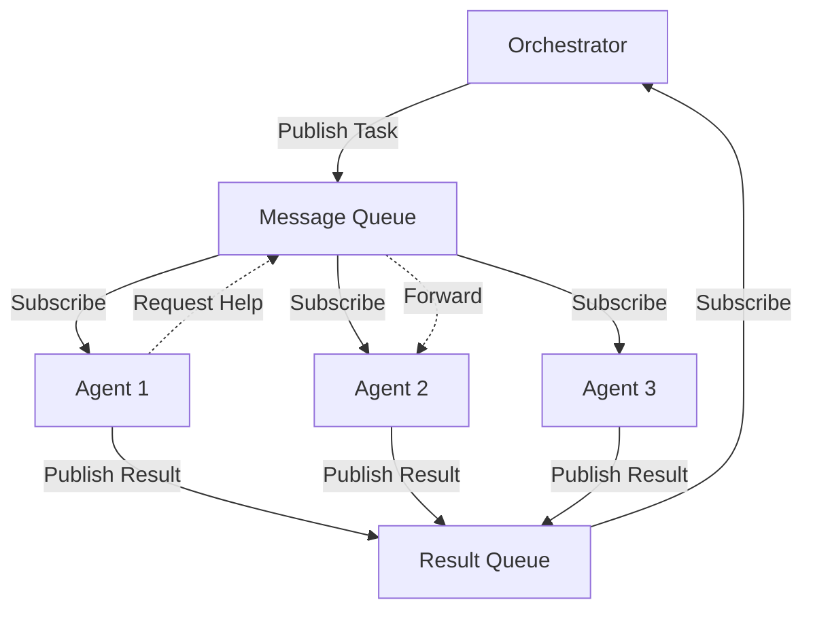

# Step 4: Message Queue and Inter-Agent Communication

## Objective
Implement a robust message queue system for inter-agent communication, task distribution, and result aggregation.

## Prerequisites
- Step 3 CLI Process Manager complete
- Understanding of event-driven architecture
- Message queue patterns knowledge

## Architecture Overview

### 4.1 Communication Flow


## Core Components

### 5.1 Message Types and Interfaces
```typescript
// src/messaging/types.ts
export interface IMessage<T = any> {
  id: string;
  type: MessageType;
  source: string;
  target?: string; // Optional for broadcast
  timestamp: Date;
  correlationId?: string;
  priority: Priority;
  ttl?: number; // Time to live in ms
  payload: T;
  metadata?: Record<string, any>;
}

export enum MessageType {
  // Task messages
  TASK_ASSIGNMENT = 'task.assignment',
  TASK_ACCEPTED = 'task.accepted',
  TASK_REJECTED = 'task.rejected',
  TASK_PROGRESS = 'task.progress',
  TASK_COMPLETED = 'task.completed',
  TASK_FAILED = 'task.failed',
  
  // Agent messages
  AGENT_READY = 'agent.ready',
  AGENT_BUSY = 'agent.busy',
  AGENT_ERROR = 'agent.error',
  AGENT_HEARTBEAT = 'agent.heartbeat',
  
  // Collaboration messages
  HELP_REQUEST = 'collab.help_request',
  HELP_OFFER = 'collab.help_offer',
  KNOWLEDGE_SHARE = 'collab.knowledge_share',
  
  // System messages
  SYSTEM_SHUTDOWN = 'system.shutdown',
  SYSTEM_PAUSE = 'system.pause',
  SYSTEM_RESUME = 'system.resume'
}

export enum Priority {
  LOW = 0,
  MEDIUM = 1,
  HIGH = 2,
  URGENT = 3
}

export interface ITaskAssignment {
  task: ITask;
  deadline?: Date;
  dependencies?: string[];
  context?: ITaskContext;
}

export interface ITaskResult {
  taskId: string;
  agentId: string;
  status: 'completed' | 'failed' | 'partial';
  result?: any;
  error?: Error;
  metrics: IExecutionMetrics;
}

export interface IHelpRequest {
  taskId: string;
  agentId: string;
  problemDescription: string;
  requiredCapabilities: string[];
  context: any;
}
```

### 5.2 Message Queue Implementation
```typescript
// src/messaging/message-queue.ts
import { EventEmitter } from 'events';
import { Logger } from '../utils/logger';
import { MessageStore } from './message-store';
import { MessageRouter } from './message-router';
import { DeadLetterQueue } from './dead-letter-queue';

export interface IMessageQueue {
  publish(message: IMessage): Promise<void>;
  subscribe(pattern: string | RegExp, handler: MessageHandler): ISubscription;
  subscribeOnce(pattern: string | RegExp, handler: MessageHandler): ISubscription;
  unsubscribe(subscription: ISubscription): void;
  getStats(): IQueueStats;
  shutdown(): Promise<void>;
}

export type MessageHandler<T = any> = (message: IMessage<T>) => Promise<void> | void;

export interface ISubscription {
  id: string;
  pattern: string | RegExp;
  unsubscribe(): void;
}

export interface IQueueStats {
  messagesPublished: number;
  messagesDelivered: number;
  messagesFailed: number;
  activeSubscriptions: number;
  queueDepth: number;
}

export class MessageQueue extends EventEmitter implements IMessageQueue {
  private subscriptions = new Map<string, IInternalSubscription>();
  private messageStore: MessageStore;
  private router: MessageRouter;
  private deadLetterQueue: DeadLetterQueue;
  private stats = {
    messagesPublished: 0,
    messagesDelivered: 0,
    messagesFailed: 0
  };
  private processing = new Set<string>();
  private shutdownRequested = false;

  constructor(
    private logger: Logger,
    private options: IMessageQueueOptions = {}
  ) {
    super();
    
    this.messageStore = new MessageStore({
      maxSize: options.maxQueueSize || 10000,
      ttl: options.defaultTTL || 300000 // 5 minutes
    });
    
    this.router = new MessageRouter(logger);
    
    this.deadLetterQueue = new DeadLetterQueue({
      maxRetries: options.maxRetries || 3,
      retryDelay: options.retryDelay || 1000
    });
    
    this.setupErrorHandling();
  }

  async publish(message: IMessage): Promise<void> {
    if (this.shutdownRequested) {
      throw new Error('Message queue is shutting down');
    }

    // Validate message
    this.validateMessage(message);
    
    // Add to store
    await this.messageStore.add(message);
    this.stats.messagesPublished++;
    
    this.logger.debug('Message published', {
      id: message.id,
      type: message.type,
      source: message.source,
      target: message.target
    });
    
    // Process asynchronously
    setImmediate(() => this.processMessage(message));
  }

  subscribe(
    pattern: string | RegExp, 
    handler: MessageHandler
  ): ISubscription {
    const subscription: IInternalSubscription = {
      id: `sub_${Date.now()}_${Math.random()}`,
      pattern,
      handler,
      once: false
    };
    
    this.subscriptions.set(subscription.id, subscription);
    this.router.addRoute(pattern, subscription.id);
    
    this.logger.debug('Subscription created', {
      id: subscription.id,
      pattern: pattern.toString()
    });
    
    return {
      id: subscription.id,
      pattern,
      unsubscribe: () => this.unsubscribe({ id: subscription.id, pattern })
    };
  }

  subscribeOnce(
    pattern: string | RegExp,
    handler: MessageHandler
  ): ISubscription {
    const subscription = this.subscribe(pattern, handler);
    const internalSub = this.subscriptions.get(subscription.id)!;
    internalSub.once = true;
    return subscription;
  }

  unsubscribe(subscription: ISubscription): void {
    const internal = this.subscriptions.get(subscription.id);
    if (!internal) return;
    
    this.subscriptions.delete(subscription.id);
    this.router.removeRoute(internal.pattern, subscription.id);
    
    this.logger.debug('Subscription removed', { id: subscription.id });
  }

  getStats(): IQueueStats {
    return {
      ...this.stats,
      activeSubscriptions: this.subscriptions.size,
      queueDepth: this.messageStore.size()
    };
  }

  async shutdown(): Promise<void> {
    this.logger.info('Shutting down message queue');
    this.shutdownRequested = true;
    
    // Wait for processing to complete
    while (this.processing.size > 0) {
      await new Promise(resolve => setTimeout(resolve, 100));
    }
    
    // Clear subscriptions
    this.subscriptions.clear();
    this.router.clear();
    
    // Save unprocessed messages
    const unprocessed = this.messageStore.getAll();
    if (unprocessed.length > 0) {
      this.logger.warn('Unprocessed messages on shutdown', {
        count: unprocessed.length
      });
    }
    
    this.removeAllListeners();
    this.logger.info('Message queue shutdown complete');
  }

  private async processMessage(message: IMessage): Promise<void> {
    const messageId = message.id;
    
    if (this.processing.has(messageId)) {
      return; // Already processing
    }
    
    this.processing.add(messageId);
    
    try {
      // Find matching subscriptions
      const subscriptionIds = this.router.route(message);
      
      if (subscriptionIds.length === 0) {
        this.logger.debug('No subscribers for message', {
          id: message.id,
          type: message.type
        });
        return;
      }
      
      // Deliver to all matching subscribers
      const deliveryPromises = subscriptionIds.map(subId => 
        this.deliverMessage(message, subId)
      );
      
      await Promise.allSettled(deliveryPromises);
      
      // Remove message from store
      this.messageStore.remove(messageId);
      
    } catch (error) {
      this.logger.error('Failed to process message', {
        messageId,
        error: error.message
      });
      
      // Add to dead letter queue
      await this.deadLetterQueue.add(message, error);
      
    } finally {
      this.processing.delete(messageId);
    }
  }

  private async deliverMessage(
    message: IMessage,
    subscriptionId: string
  ): Promise<void> {
    const subscription = this.subscriptions.get(subscriptionId);
    if (!subscription) return;
    
    try {
      // Execute handler
      await Promise.resolve(subscription.handler(message));
      
      this.stats.messagesDelivered++;
      
      // Remove if once
      if (subscription.once) {
        this.unsubscribe({
          id: subscriptionId,
          pattern: subscription.pattern
        });
      }
      
    } catch (error) {
      this.stats.messagesFailed++;
      
      this.logger.error('Message handler failed', {
        messageId: message.id,
        subscriptionId,
        error: error.message
      });
      
      // Re-throw to trigger dead letter queue
      throw error;
    }
  }

  private validateMessage(message: IMessage): void {
    if (!message.id || !message.type || !message.source) {
      throw new Error('Invalid message: missing required fields');
    }
    
    if (message.ttl && message.ttl < 0) {
      throw new Error('Invalid message: negative TTL');
    }
  }

  private setupErrorHandling(): void {
    this.on('error', (error) => {
      this.logger.error('Message queue error', error);
    });
    
    // Periodic cleanup
    setInterval(() => {
      const expired = this.messageStore.removeExpired();
      if (expired > 0) {
        this.logger.debug('Removed expired messages', { count: expired });
      }
    }, 60000); // Every minute
  }
}

interface IInternalSubscription {
  id: string;
  pattern: string | RegExp;
  handler: MessageHandler;
  once: boolean;
}

interface IMessageQueueOptions {
  maxQueueSize?: number;
  defaultTTL?: number;
  maxRetries?: number;
  retryDelay?: number;
}
```

### 5.3 Message Router
```typescript
// src/messaging/message-router.ts
export class MessageRouter {
  private routes = new Map<string, Set<string>>();
  private regexRoutes = new Map<RegExp, Set<string>>();
  
  constructor(private logger: Logger) {}

  addRoute(pattern: string | RegExp, subscriptionId: string): void {
    if (typeof pattern === 'string') {
      const subs = this.routes.get(pattern) || new Set();
      subs.add(subscriptionId);
      this.routes.set(pattern, subs);
    } else {
      const subs = this.regexRoutes.get(pattern) || new Set();
      subs.add(subscriptionId);
      this.regexRoutes.set(pattern, subs);
    }
  }

  removeRoute(pattern: string | RegExp, subscriptionId: string): void {
    if (typeof pattern === 'string') {
      const subs = this.routes.get(pattern);
      if (subs) {
        subs.delete(subscriptionId);
        if (subs.size === 0) {
          this.routes.delete(pattern);
        }
      }
    } else {
      const subs = this.regexRoutes.get(pattern);
      if (subs) {
        subs.delete(subscriptionId);
        if (subs.size === 0) {
          this.regexRoutes.delete(pattern);
        }
      }
    }
  }

  route(message: IMessage): string[] {
    const subscriptionIds = new Set<string>();
    
    // Check exact matches
    const key = this.getRouteKey(message);
    const exactMatches = this.routes.get(key);
    if (exactMatches) {
      exactMatches.forEach(id => subscriptionIds.add(id));
    }
    
    // Check regex matches
    for (const [pattern, subs] of this.regexRoutes.entries()) {
      if (pattern.test(key)) {
        subs.forEach(id => subscriptionIds.add(id));
      }
    }
    
    // Check targeted messages
    if (message.target) {
      const targetKey = `target:${message.target}`;
      const targetMatches = this.routes.get(targetKey);
      if (targetMatches) {
        targetMatches.forEach(id => subscriptionIds.add(id));
      }
    }
    
    return Array.from(subscriptionIds);
  }

  clear(): void {
    this.routes.clear();
    this.regexRoutes.clear();
  }

  private getRouteKey(message: IMessage): string {
    return message.type;
  }
}
```

### 5.4 Agent Communication Layer
```typescript
// src/messaging/agent-communicator.ts
export class AgentCommunicator {
  private messageQueue: IMessageQueue;
  private subscriptions: ISubscription[] = [];
  
  constructor(
    private agentId: string,
    messageQueue: IMessageQueue,
    private logger: Logger
  ) {
    this.messageQueue = messageQueue;
    this.setupBaseSubscriptions();
  }

  // Publishing methods
  async publishReady(): Promise<void> {
    await this.publish({
      type: MessageType.AGENT_READY,
      payload: {
        agentId: this.agentId,
        capabilities: this.getCapabilities()
      }
    });
  }

  async publishBusy(taskId: string): Promise<void> {
    await this.publish({
      type: MessageType.AGENT_BUSY,
      payload: { agentId: this.agentId, taskId }
    });
  }

  async publishTaskProgress(
    taskId: string,
    progress: number,
    message?: string
  ): Promise<void> {
    await this.publish({
      type: MessageType.TASK_PROGRESS,
      payload: {
        taskId,
        agentId: this.agentId,
        progress,
        message
      },
      correlationId: taskId
    });
  }

  async publishTaskCompleted(result: ITaskResult): Promise<void> {
    await this.publish({
      type: MessageType.TASK_COMPLETED,
      payload: result,
      correlationId: result.taskId,
      priority: Priority.HIGH
    });
  }

  async publishTaskFailed(
    taskId: string,
    error: Error,
    partial?: any
  ): Promise<void> {
    await this.publish({
      type: MessageType.TASK_FAILED,
      payload: {
        taskId,
        agentId: this.agentId,
        error: {
          message: error.message,
          stack: error.stack,
          name: error.name
        },
        partial
      },
      correlationId: taskId,
      priority: Priority.HIGH
    });
  }

  async requestHelp(request: IHelpRequest): Promise<void> {
    await this.publish({
      type: MessageType.HELP_REQUEST,
      payload: request,
      priority: Priority.HIGH,
      ttl: 60000 // 1 minute
    });
  }

  // Subscription methods
  onTaskAssignment(
    handler: (assignment: ITaskAssignment) => Promise<void>
  ): ISubscription {
    return this.subscribe(
      MessageType.TASK_ASSIGNMENT,
      async (message) => {
        if (this.isTargetedToMe(message)) {
          await handler(message.payload);
        }
      }
    );
  }

  onHelpRequest(
    handler: (request: IHelpRequest) => Promise<void>
  ): ISubscription {
    return this.subscribe(
      MessageType.HELP_REQUEST,
      async (message) => {
        // Don't respond to own help requests
        if (message.source !== this.agentId) {
          await handler(message.payload);
        }
      }
    );
  }

  onSystemShutdown(handler: () => Promise<void>): ISubscription {
    return this.subscribe(
      MessageType.SYSTEM_SHUTDOWN,
      async () => await handler()
    );
  }

  // Lifecycle
  async shutdown(): Promise<void> {
    this.logger.debug('Shutting down agent communicator', {
      agentId: this.agentId
    });
    
    // Unsubscribe all
    for (const sub of this.subscriptions) {
      sub.unsubscribe();
    }
    
    this.subscriptions = [];
  }

  // Private helpers
  private async publish(messageData: Partial<IMessage>): Promise<void> {
    const message: IMessage = {
      id: `${this.agentId}_${Date.now()}_${Math.random()}`,
      source: this.agentId,
      timestamp: new Date(),
      priority: Priority.MEDIUM,
      ...messageData
    } as IMessage;
    
    await this.messageQueue.publish(message);
  }

  private subscribe(
    pattern: string | RegExp,
    handler: MessageHandler
  ): ISubscription {
    const subscription = this.messageQueue.subscribe(pattern, handler);
    this.subscriptions.push(subscription);
    return subscription;
  }

  private setupBaseSubscriptions(): void {
    // Subscribe to targeted messages
    this.subscribe(
      `target:${this.agentId}`,
      (message) => this.handleTargetedMessage(message)
    );
    
    // Subscribe to broadcasts
    this.subscribe(
      /^agent\./,
      (message) => this.handleBroadcast(message)
    );
  }

  private isTargetedToMe(message: IMessage): boolean {
    return !message.target || message.target === this.agentId;
  }

  private async handleTargetedMessage(message: IMessage): Promise<void> {
    this.logger.debug('Received targeted message', {
      type: message.type,
      from: message.source
    });
  }

  private async handleBroadcast(message: IMessage): Promise<void> {
    // Handle system-wide broadcasts
    if (message.type === MessageType.SYSTEM_PAUSE) {
      this.logger.info('System pause requested');
    }
  }

  private getCapabilities(): string[] {
    // This would be overridden by specific agent types
    return ['general'];
  }
}
```

### 5.5 Dead Letter Queue
```typescript
// src/messaging/dead-letter-queue.ts
export interface IDeadLetterQueueOptions {
  maxRetries: number;
  retryDelay: number;
}

export class DeadLetterQueue {
  private queue: IDeadLetter[] = [];
  private retryTimers = new Map<string, NodeJS.Timeout>();
  
  constructor(private options: IDeadLetterQueueOptions) {}

  async add(message: IMessage, error: Error): Promise<void> {
    const deadLetter: IDeadLetter = {
      message,
      error: {
        message: error.message,
        stack: error.stack,
        name: error.name
      },
      attempts: 1,
      firstFailure: new Date(),
      lastFailure: new Date()
    };
    
    // Check if already in queue
    const existing = this.queue.find(dl => dl.message.id === message.id);
    if (existing) {
      existing.attempts++;
      existing.lastFailure = new Date();
      
      if (existing.attempts >= this.options.maxRetries) {
        // Move to permanent failure
        await this.handlePermanentFailure(existing);
        this.removeFromQueue(message.id);
      } else {
        // Schedule retry
        this.scheduleRetry(existing);
      }
    } else {
      this.queue.push(deadLetter);
      this.scheduleRetry(deadLetter);
    }
  }

  getAll(): IDeadLetter[] {
    return [...this.queue];
  }

  remove(messageId: string): boolean {
    const index = this.queue.findIndex(dl => dl.message.id === messageId);
    if (index !== -1) {
      this.queue.splice(index, 1);
      this.cancelRetry(messageId);
      return true;
    }
    return false;
  }

  clear(): void {
    // Cancel all retries
    for (const [id, timer] of this.retryTimers.entries()) {
      clearTimeout(timer);
    }
    this.retryTimers.clear();
    this.queue = [];
  }

  private scheduleRetry(deadLetter: IDeadLetter): void {
    const delay = this.options.retryDelay * Math.pow(2, deadLetter.attempts - 1);
    
    const timer = setTimeout(() => {
      this.retryMessage(deadLetter);
    }, delay);
    
    this.retryTimers.set(deadLetter.message.id, timer);
  }

  private async retryMessage(deadLetter: IDeadLetter): Promise<void> {
    // This would be injected or configured
    // For now, just log
    console.log('Retrying message', deadLetter.message.id);
  }

  private cancelRetry(messageId: string): void {
    const timer = this.retryTimers.get(messageId);
    if (timer) {
      clearTimeout(timer);
      this.retryTimers.delete(messageId);
    }
  }

  private async handlePermanentFailure(deadLetter: IDeadLetter): Promise<void> {
    // Log permanent failure
    console.error('Message permanently failed', {
      messageId: deadLetter.message.id,
      attempts: deadLetter.attempts,
      error: deadLetter.error
    });
    
    // Could write to file, database, or alert
  }

  private removeFromQueue(messageId: string): void {
    const index = this.queue.findIndex(dl => dl.message.id === messageId);
    if (index !== -1) {
      this.queue.splice(index, 1);
    }
  }
}

interface IDeadLetter {
  message: IMessage;
  error: {
    message: string;
    stack?: string;
    name: string;
  };
  attempts: number;
  firstFailure: Date;
  lastFailure: Date;
}
```

## Testing the Message Queue

### 6.1 Message Queue Tests
```typescript
// src/messaging/__tests__/message-queue.spec.ts
describe('MessageQueue', () => {
  let queue: MessageQueue;
  let logger: jest.Mocked<Logger>;

  beforeEach(() => {
    logger = createMock<Logger>();
    queue = new MessageQueue(logger);
  });

  afterEach(async () => {
    await queue.shutdown();
  });

  describe('publish and subscribe', () => {
    it('should deliver message to subscriber', async () => {
      // Arrange
      const handler = jest.fn();
      queue.subscribe(MessageType.TASK_ASSIGNMENT, handler);
      
      const message: IMessage = {
        id: 'test-1',
        type: MessageType.TASK_ASSIGNMENT,
        source: 'test-source',
        timestamp: new Date(),
        priority: Priority.MEDIUM,
        payload: { task: 'test' }
      };

      // Act
      await queue.publish(message);
      
      // Wait for async processing
      await new Promise(resolve => setTimeout(resolve, 10));

      // Assert
      expect(handler).toHaveBeenCalledWith(message);
      expect(queue.getStats().messagesDelivered).toBe(1);
    });

    it('should support pattern matching', async () => {
      // Arrange
      const handler = jest.fn();
      queue.subscribe(/^task\./, handler);
      
      const message1: IMessage = {
        id: 'test-1',
        type: MessageType.TASK_COMPLETED,
        source: 'agent-1',
        timestamp: new Date(),
        priority: Priority.HIGH,
        payload: {}
      };
      
      const message2: IMessage = {
        id: 'test-2',
        type: MessageType.AGENT_READY,
        source: 'agent-2',
        timestamp: new Date(),
        priority: Priority.LOW,
        payload: {}
      };

      // Act
      await queue.publish(message1);
      await queue.publish(message2);
      await new Promise(resolve => setTimeout(resolve, 10));

      // Assert
      expect(handler).toHaveBeenCalledTimes(1);
      expect(handler).toHaveBeenCalledWith(message1);
    });

    it('should handle targeted messages', async () => {
      // Arrange
      const handler1 = jest.fn();
      const handler2 = jest.fn();
      
      queue.subscribe('target:agent-1', handler1);
      queue.subscribe('target:agent-2', handler2);
      
      const message: IMessage = {
        id: 'test-1',
        type: MessageType.TASK_ASSIGNMENT,
        source: 'orchestrator',
        target: 'agent-1',
        timestamp: new Date(),
        priority: Priority.HIGH,
        payload: {}
      };

      // Act
      await queue.publish(message);
      await new Promise(resolve => setTimeout(resolve, 10));

      // Assert
      expect(handler1).toHaveBeenCalledWith(message);
      expect(handler2).not.toHaveBeenCalled();
    });

    it('should handle subscribeOnce', async () => {
      // Arrange
      const handler = jest.fn();
      queue.subscribeOnce(MessageType.HELP_REQUEST, handler);
      
      const message1: IMessage = {
        id: 'test-1',
        type: MessageType.HELP_REQUEST,
        source: 'agent-1',
        timestamp: new Date(),
        priority: Priority.HIGH,
        payload: {}
      };
      
      const message2: IMessage = {
        id: 'test-2',
        type: MessageType.HELP_REQUEST,
        source: 'agent-2',
        timestamp: new Date(),
        priority: Priority.HIGH,
        payload: {}
      };

      // Act
      await queue.publish(message1);
      await queue.publish(message2);
      await new Promise(resolve => setTimeout(resolve, 20));

      // Assert
      expect(handler).toHaveBeenCalledTimes(1);
      expect(handler).toHaveBeenCalledWith(message1);
    });
  });

  describe('error handling', () => {
    it('should handle handler errors', async () => {
      // Arrange
      const handler = jest.fn().mockRejectedValue(new Error('Handler error'));
      queue.subscribe(MessageType.TASK_COMPLETED, handler);
      
      const message: IMessage = {
        id: 'test-1',
        type: MessageType.TASK_COMPLETED,
        source: 'agent-1',
        timestamp: new Date(),
        priority: Priority.MEDIUM,
        payload: {}
      };

      // Act
      await queue.publish(message);
      await new Promise(resolve => setTimeout(resolve, 10));

      // Assert
      expect(handler).toHaveBeenCalled();
      expect(queue.getStats().messagesFailed).toBe(1);
    });

    it('should validate messages', async () => {
      // Arrange
      const invalidMessage = {
        type: MessageType.TASK_ASSIGNMENT,
        payload: {}
      } as any;

      // Act & Assert
      await expect(queue.publish(invalidMessage))
        .rejects.toThrow('Invalid message: missing required fields');
    });
  });

  describe('shutdown', () => {
    it('should reject publishes after shutdown', async () => {
      // Arrange
      const message: IMessage = {
        id: 'test-1',
        type: MessageType.TASK_ASSIGNMENT,
        source: 'test',
        timestamp: new Date(),
        priority: Priority.MEDIUM,
        payload: {}
      };

      // Act
      await queue.shutdown();

      // Assert
      await expect(queue.publish(message))
        .rejects.toThrow('Message queue is shutting down');
    });
  });
});
```

### 6.2 Agent Communicator Tests
```typescript
// src/messaging/__tests__/agent-communicator.spec.ts
describe('AgentCommunicator', () => {
  let communicator: AgentCommunicator;
  let mockQueue: jest.Mocked<IMessageQueue>;
  let logger: jest.Mocked<Logger>;

  beforeEach(() => {
    mockQueue = createMock<IMessageQueue>();
    logger = createMock<Logger>();
    
    mockQueue.subscribe.mockReturnValue({
      id: 'sub-1',
      pattern: 'test',
      unsubscribe: jest.fn()
    });
    
    communicator = new AgentCommunicator('agent-1', mockQueue, logger);
  });

  describe('publishing', () => {
    it('should publish ready message', async () => {
      // Act
      await communicator.publishReady();

      // Assert
      expect(mockQueue.publish).toHaveBeenCalledWith(
        expect.objectContaining({
          type: MessageType.AGENT_READY,
          source: 'agent-1',
          payload: expect.objectContaining({
            agentId: 'agent-1'
          })
        })
      );
    });

    it('should publish task completed', async () => {
      // Arrange
      const result: ITaskResult = {
        taskId: 'task-1',
        agentId: 'agent-1',
        status: 'completed',
        result: { data: 'test' },
        metrics: {
          duration_ms: 1000,
          cost_usd: 0.01,
          turns_used: 2
        }
      };

      // Act
      await communicator.publishTaskCompleted(result);

      // Assert
      expect(mockQueue.publish).toHaveBeenCalledWith(
        expect.objectContaining({
          type: MessageType.TASK_COMPLETED,
          payload: result,
          correlationId: 'task-1',
          priority: Priority.HIGH
        })
      );
    });

    it('should request help', async () => {
      // Arrange
      const request: IHelpRequest = {
        taskId: 'task-1',
        agentId: 'agent-1',
        problemDescription: 'Need code review',
        requiredCapabilities: ['code_review'],
        context: {}
      };

      // Act
      await communicator.requestHelp(request);

      // Assert
      expect(mockQueue.publish).toHaveBeenCalledWith(
        expect.objectContaining({
          type: MessageType.HELP_REQUEST,
          payload: request,
          priority: Priority.HIGH,
          ttl: 60000
        })
      );
    });
  });

  describe('subscriptions', () => {
    it('should handle task assignments', async () => {
      // Arrange
      const handler = jest.fn();
      let capturedHandler: MessageHandler;
      
      mockQueue.subscribe.mockImplementation((pattern, h) => {
        capturedHandler = h;
        return {
          id: 'sub-1',
          pattern,
          unsubscribe: jest.fn()
        };
      });

      // Act
      communicator.onTaskAssignment(handler);
      
      // Simulate message
      const message: IMessage<ITaskAssignment> = {
        id: 'msg-1',
        type: MessageType.TASK_ASSIGNMENT,
        source: 'orchestrator',
        target: 'agent-1',
        timestamp: new Date(),
        priority: Priority.HIGH,
        payload: {
          task: {
            id: 'task-1',
            type: 'research',
            priority: 'high',
            description: 'Test task'
          }
        }
      };
      
      await capturedHandler!(message);

      // Assert
      expect(handler).toHaveBeenCalledWith(message.payload);
    });

    it('should ignore own help requests', async () => {
      // Arrange
      const handler = jest.fn();
      let capturedHandler: MessageHandler;
      
      mockQueue.subscribe.mockImplementation((pattern, h) => {
        capturedHandler = h;
        return {
          id: 'sub-1',
          pattern,
          unsubscribe: jest.fn()
        };
      });

      // Act
      communicator.onHelpRequest(handler);
      
      // Simulate own help request
      const message: IMessage<IHelpRequest> = {
        id: 'msg-1',
        type: MessageType.HELP_REQUEST,
        source: 'agent-1', // Same as communicator
        timestamp: new Date(),
        priority: Priority.HIGH,
        payload: {
          taskId: 'task-1',
          agentId: 'agent-1',
          problemDescription: 'Help',
          requiredCapabilities: [],
          context: {}
        }
      };
      
      await capturedHandler!(message);

      // Assert
      expect(handler).not.toHaveBeenCalled();
    });
  });
});
```

## Integration Examples

### 7.1 Agent Integration
```typescript
// Example: Integrating message queue with agent
class MessageAwareAgent extends BaseAgent {
  private communicator: AgentCommunicator;
  
  protected async onInitialize(): Promise<void> {
    this.communicator = new AgentCommunicator(
      this.id,
      this.messageQueue,
      this.logger
    );
    
    // Setup subscriptions
    this.communicator.onTaskAssignment(
      async (assignment) => await this.handleTaskAssignment(assignment)
    );
    
    this.communicator.onHelpRequest(
      async (request) => await this.handleHelpRequest(request)
    );
    
    // Announce ready
    await this.communicator.publishReady();
  }
  
  private async handleTaskAssignment(
    assignment: ITaskAssignment
  ): Promise<void> {
    try {
      // Accept task
      await this.communicator.publishBusy(assignment.task.id);
      
      // Execute
      const result = await this.execute(assignment.task);
      
      // Publish result
      await this.communicator.publishTaskCompleted(result);
      
    } catch (error) {
      await this.communicator.publishTaskFailed(
        assignment.task.id,
        error
      );
    }
  }
  
  private async handleHelpRequest(
    request: IHelpRequest
  ): Promise<void> {
    // Check if we can help
    if (this.canHelp(request)) {
      // Offer help
      await this.communicator.publish({
        type: MessageType.HELP_OFFER,
        payload: {
          requestId: request.taskId,
          agentId: this.id,
          capabilities: this.getCapabilities()
        }
      });
    }
  }
}
```

### 7.2 Orchestrator Integration
```typescript
// Example: Orchestrator using message queue
class MessageOrchestrator {
  private taskResults = new Map<string, ITaskResult[]>();
  
  async initialize(): Promise<void> {
    // Subscribe to agent status
    this.messageQueue.subscribe(
      MessageType.AGENT_READY,
      (msg) => this.handleAgentReady(msg)
    );
    
    // Subscribe to task results
    this.messageQueue.subscribe(
      MessageType.TASK_COMPLETED,
      (msg) => this.handleTaskCompleted(msg)
    );
    
    this.messageQueue.subscribe(
      MessageType.TASK_FAILED,
      (msg) => this.handleTaskFailed(msg)
    );
  }
  
  async assignTask(task: ITask, agentId: string): Promise<void> {
    await this.messageQueue.publish({
      id: `assign_${task.id}`,
      type: MessageType.TASK_ASSIGNMENT,
      source: 'orchestrator',
      target: agentId,
      timestamp: new Date(),
      priority: this.getTaskPriority(task),
      payload: {
        task,
        deadline: this.calculateDeadline(task),
        context: await this.buildTaskContext(task)
      }
    });
  }
}
```

## Performance Optimization

### 8.1 Message Batching
```typescript
// src/messaging/message-batcher.ts
export class MessageBatcher {
  private batch: IMessage[] = [];
  private timer?: NodeJS.Timeout;
  
  constructor(
    private queue: IMessageQueue,
    private options: {
      maxBatchSize: number;
      maxBatchDelay: number;
    }
  ) {}
  
  async add(message: IMessage): Promise<void> {
    this.batch.push(message);
    
    if (this.batch.length >= this.options.maxBatchSize) {
      await this.flush();
    } else if (!this.timer) {
      this.timer = setTimeout(() => this.flush(), this.options.maxBatchDelay);
    }
  }
  
  private async flush(): Promise<void> {
    if (this.timer) {
      clearTimeout(this.timer);
      this.timer = undefined;
    }
    
    if (this.batch.length === 0) return;
    
    const messages = [...this.batch];
    this.batch = [];
    
    // Publish all at once
    await Promise.all(
      messages.map(msg => this.queue.publish(msg))
    );
  }
}
```

## Implementation Timeline

### Day 1: Core Queue
1. **Morning**:
   - Implement message queue
   - Message routing
   - Basic pub/sub

2. **Afternoon**:
   - Dead letter queue
   - Error handling
   - Testing

### Day 2: Agent Integration
1. **Morning**:
   - Agent communicator
   - Message patterns
   - Integration helpers

2. **Afternoon**:
   - Performance optimization
   - Monitoring
   - Documentation

## Success Metrics
- Message delivery reliability >99.9%
- Average delivery latency <10ms
- Support 1000+ messages/second
- Zero message loss during shutdown
- 100% test coverage maintained

## Next Steps
After completing message queue:
1. Proceed to Step 5: Single Agent System (Baseline)
2. Integrate with all agents
3. Build orchestration patterns