# Claude Multi-Agent System Architecture

## Executive Summary

The Claude Multi-Agent System is designed to spawn and orchestrate multiple Claude CLI agents working collaboratively on software engineering tasks. The architecture emphasizes isolation, scalability, and conflict prevention while maintaining high performance and reliability.

## System Architecture Overview

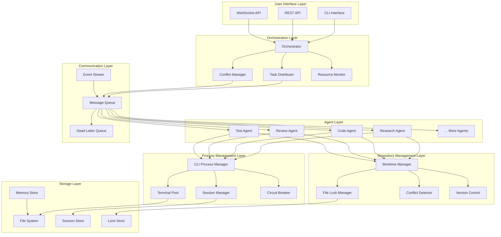

## Component Architecture

### 1. Orchestration Layer

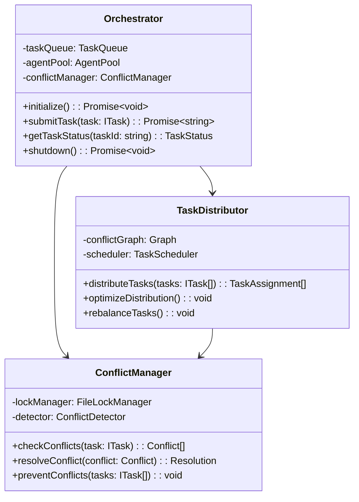

### 2. Agent Architecture

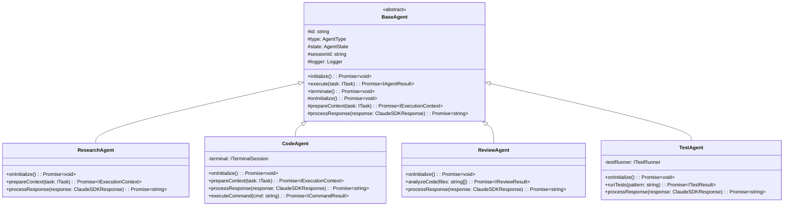

### 3. Process Management Architecture

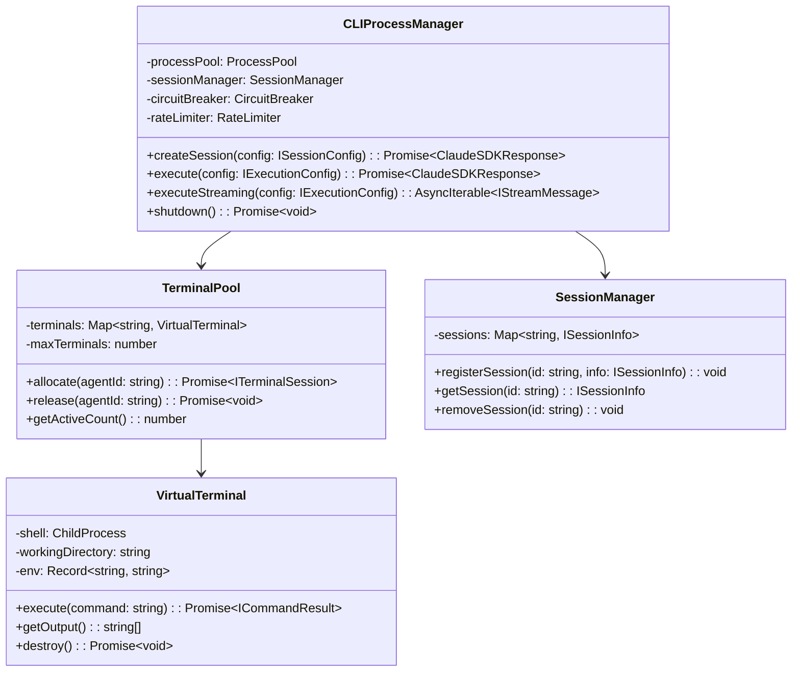

### 4. Repository Management Architecture

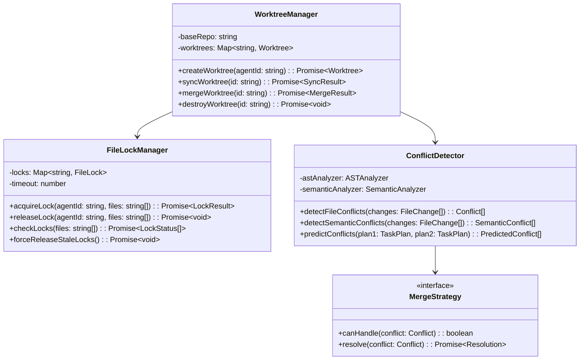

## Data Flow Architecture

### 1. Task Execution Flow

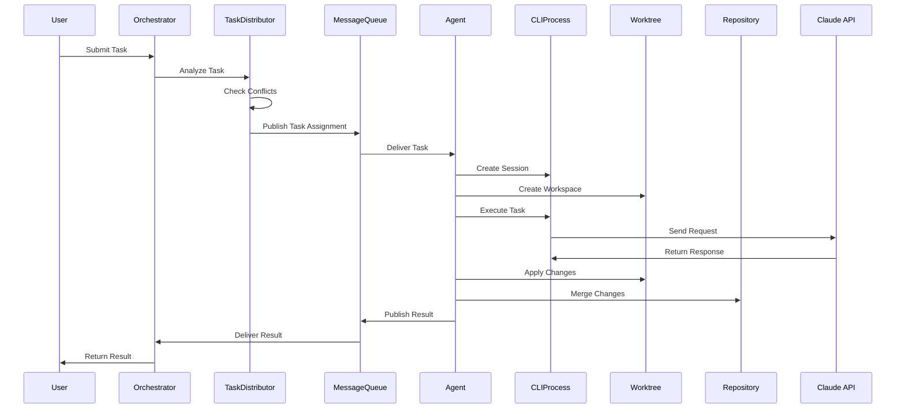

### 2. Conflict Resolution Flow

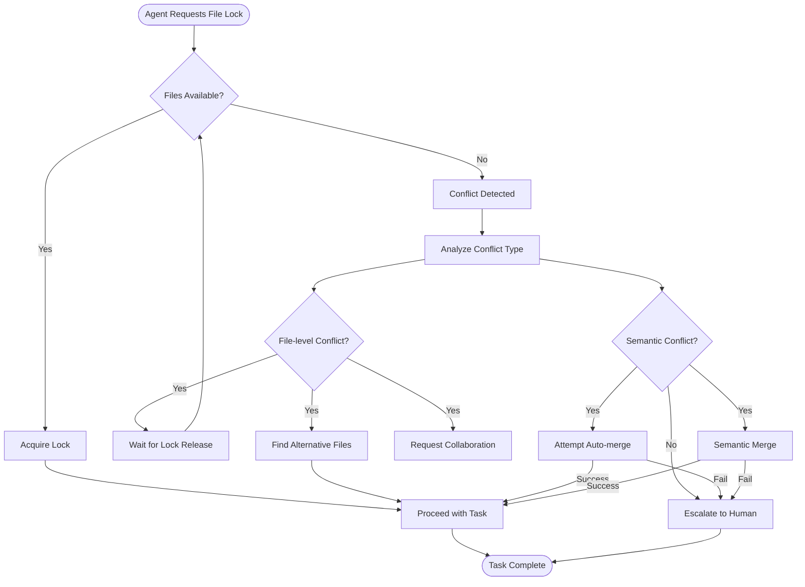

## Communication Architecture

### 1. Message Queue Pattern

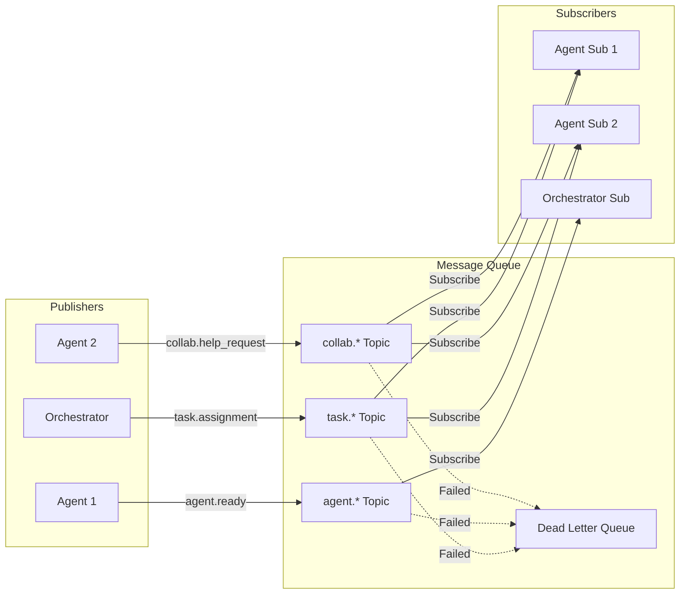

### 2. Session Management

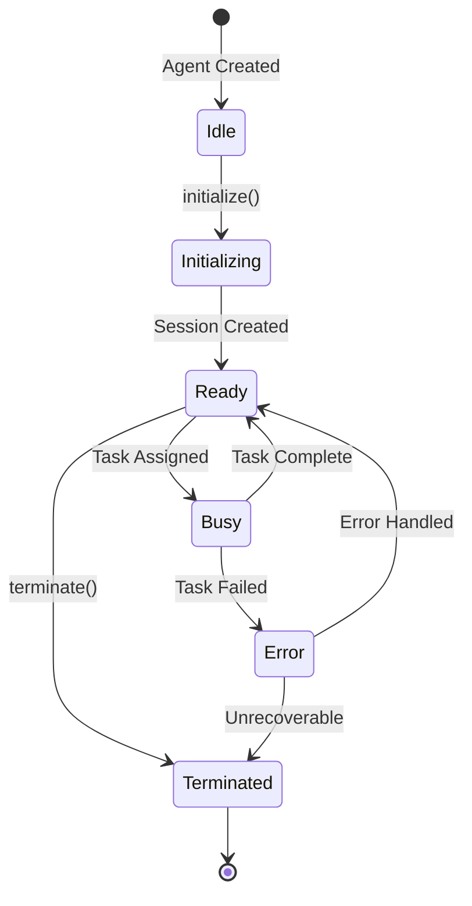

## Deployment Architecture

### 1. Container Architecture (Optional)

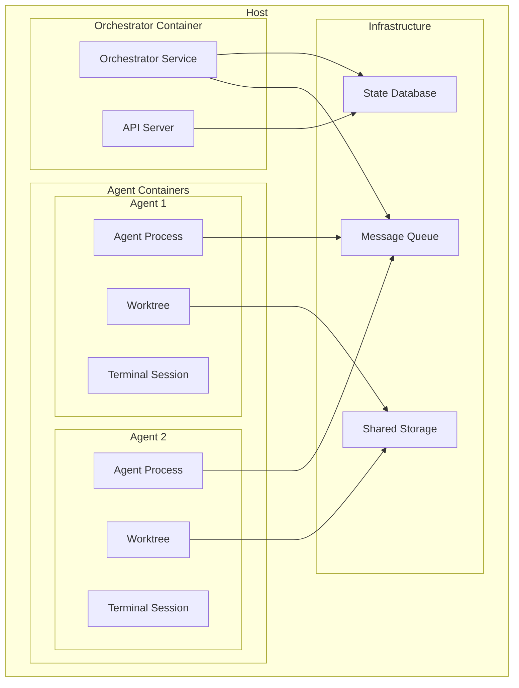

### 2. Resource Allocation

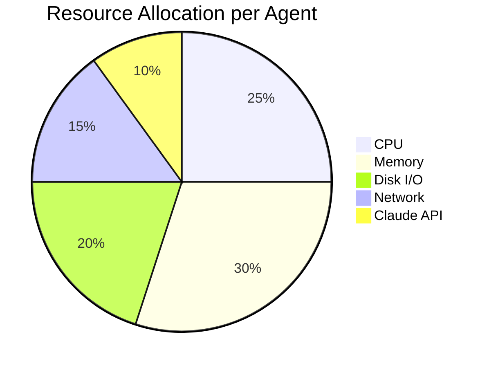

## Security Architecture

### 1. Permission Model

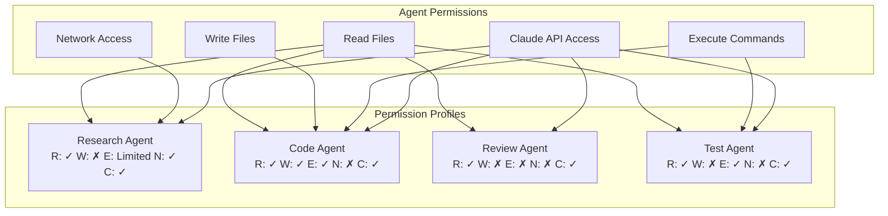

## Performance Architecture

### 1. Caching Strategy

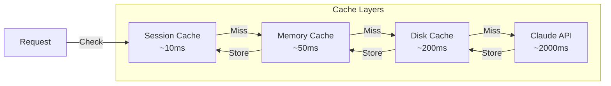

### 2. Scalability Model

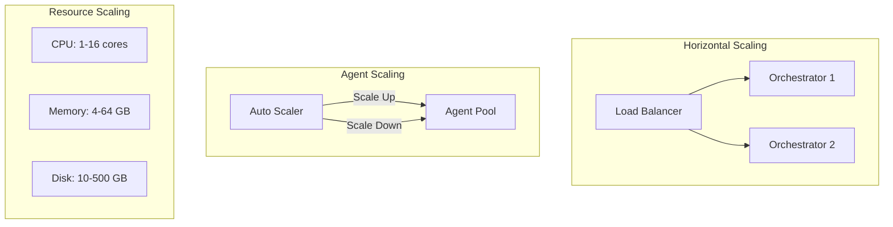

## Technology Stack

- **Runtime**: Node.js 18+
- **Language**: TypeScript 5+
- **CLI Framework**: Claude CLI SDK mode
- **Process Management**: Node.js child_process
- **Version Control**: Git with worktrees
- **Message Queue**: In-memory with persistence option
- **Testing**: Jest with 100% coverage
- **Monitoring**: Custom metrics collection
- **Logging**: Winston/Pino
- **Container**: Docker (optional)

## Architecture Principles

1. **Isolation First**: Every agent operates in complete isolation
2. **Fail Fast**: Early detection and handling of conflicts
3. **Eventual Consistency**: Agents converge to consistent state
4. **Observability**: Complete visibility into system operation
5. **Scalability**: Horizontal scaling of agents
6. **Resilience**: Circuit breakers and retry mechanisms
7. **Security**: Principle of least privilege