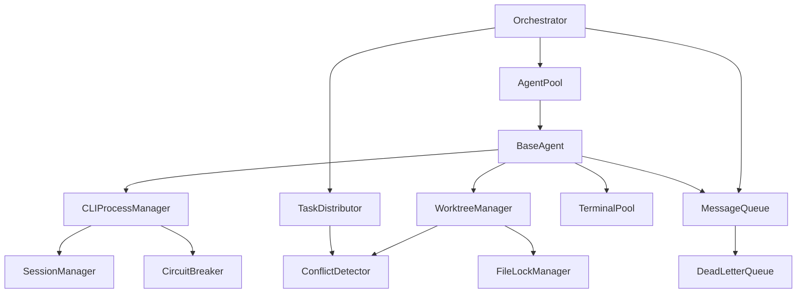

# Key Modules and Critical Success Factors

## Critical Success Factors

### 1. Claude CLI Integration (CRITICAL)
- **Success Criteria**: Reliable SDK mode operation with <1% failure rate
- **Key Features**:
  - JSON output parsing with 100% success
  - Session management and continuity
  - System prompt customization
  - Permission control
- **Dependencies**: Claude CLI installed and authenticated
- **Risk Level**: HIGH - Core dependency

### 2. Process Isolation (CRITICAL)
- **Success Criteria**: Complete isolation between agents
- **Key Features**:
  - Separate working directories per agent
  - Independent terminal sessions
  - Isolated environment variables
  - Resource limits enforcement
- **Dependencies**: OS-level process management
- **Risk Level**: HIGH - Security and stability

### 3. Conflict Prevention (CRITICAL)
- **Success Criteria**: Zero data corruption, <5% conflict rate
- **Key Features**:
  - Git worktree isolation
  - File-level locking
  - Semantic conflict detection
  - Automated merge strategies
- **Dependencies**: Git, file system locks
- **Risk Level**: HIGH - Data integrity

### 4. Message Queue Reliability (HIGH)
- **Success Criteria**: 99.9% message delivery, <10ms latency
- **Key Features**:
  - At-least-once delivery
  - Dead letter queue
  - Message persistence
  - Ordered processing
- **Dependencies**: In-memory implementation
- **Risk Level**: MEDIUM - Can be mitigated

### 5. Agent Orchestration (HIGH)
- **Success Criteria**: Efficient task distribution, <100ms assignment
- **Key Features**:
  - Smart task routing
  - Load balancing
  - Priority queuing
  - Health monitoring
- **Dependencies**: Task analyzer, agent pool
- **Risk Level**: MEDIUM - Algorithmic complexity

## Core Modules

### 1. CLI Process Manager
**Purpose**: Manages Claude CLI process lifecycle and communication

```typescript
// Core responsibilities
class CLIProcessManager {
  // Process spawning with proper arguments
  createSession(config: ISessionConfig): Promise<ClaudeSDKResponse>
  
  // Session-based execution
  execute(config: IExecutionConfig): Promise<ClaudeSDKResponse>
  
  // Stream processing for real-time feedback
  executeStreaming(config: IExecutionConfig): AsyncIterable<IStreamMessage>
  
  // Resource cleanup
  shutdown(): Promise<void>
}
```

**Critical Implementation Details**:
- Always use `-p` flag for SDK mode
- Parse JSON output reliably
- Handle process timeouts
- Implement circuit breaker pattern
- Track session IDs for continuity

### 2. Agent Base Class
**Purpose**: Foundation for all specialized agents

```typescript
abstract class BaseAgent {
  // Lifecycle management
  abstract initialize(): Promise<void>
  abstract execute(task: ITask): Promise<IAgentResult>
  abstract terminate(): Promise<void>
  
  // State management
  protected state: AgentState
  protected sessionId: string
  
  // Metrics collection
  protected metrics: MetricsCollector
}
```

**Critical Implementation Details**:
- Proper state machine implementation
- Error handling and recovery
- Metric collection for monitoring
- Session persistence
- Clean shutdown procedures

### 3. Terminal Pool Manager
**Purpose**: Manages isolated terminal sessions for agents

```typescript
class TerminalPoolManager {
  // Resource allocation
  allocate(agentId: string): Promise<ITerminalSession>
  
  // Resource cleanup
  release(agentId: string): Promise<void>
  
  // Health monitoring
  enforceResourceLimits(): Promise<void>
}
```

**Critical Implementation Details**:
- Create isolated working directories
- Set proper environment variables
- Implement LRU eviction
- Monitor resource usage
- Clean up on termination

### 4. Worktree Manager
**Purpose**: Manages Git worktrees for parallel development

```typescript
class WorktreeManager {
  // Workspace creation
  createWorktree(agentId: string, taskId: string): Promise<IWorktree>
  
  // Synchronization
  syncWorktree(worktreeId: string): Promise<ISyncResult>
  
  // Integration
  mergeWorktree(worktreeId: string): Promise<IMergeResult>
}
```

**Critical Implementation Details**:
- Use `git worktree add` efficiently
- Handle branch naming conventions
- Implement conflict detection
- Clean merge strategies
- Proper cleanup after use

### 5. Message Queue
**Purpose**: Reliable inter-agent communication

```typescript
class MessageQueue {
  // Publishing
  publish(message: IMessage): Promise<void>
  
  // Subscription
  subscribe(pattern: string | RegExp, handler: MessageHandler): ISubscription
  
  // Reliability
  private messageStore: MessageStore
  private deadLetterQueue: DeadLetterQueue
}
```

**Critical Implementation Details**:
- Implement retry logic
- Handle message ordering
- Persist critical messages
- Monitor queue depth
- Implement back-pressure

### 6. Conflict Detector
**Purpose**: Prevents and resolves code conflicts

```typescript
class ConflictDetector {
  // Detection
  detectFileConflicts(changes: IFileChange[]): IConflict[]
  detectSemanticConflicts(changes: IFileChange[]): ISemanticConflict[]
  
  // Prevention
  predictConflicts(plan1: ITaskPlan, plan2: ITaskPlan): IPredictedConflict[]
  
  // Resolution
  resolveConflict(conflict: IConflict): Promise<IResolution>
}
```

**Critical Implementation Details**:
- AST parsing for semantic analysis
- Pattern matching for file conflicts
- Integration test validation
- Multiple resolution strategies
- Human escalation path

### 7. File Lock Manager
**Purpose**: Prevents concurrent file modifications

```typescript
class FileLockManager {
  // Lock acquisition
  acquireLock(agentId: string, files: string[]): Promise<ILockResult>
  
  // Lock release
  releaseLock(agentId: string, files: string[]): Promise<void>
  
  // Monitoring
  forceReleaseStaleLocks(): Promise<void>
}
```

**Critical Implementation Details**:
- Atomic lock operations
- Timeout handling
- Stale lock detection
- Distributed lock support (future)
- Performance optimization

### 8. Orchestrator
**Purpose**: Coordinates all system components

```typescript
class Orchestrator {
  // Task management
  submitTask(task: ITask): Promise<string>
  
  // Agent coordination
  private agentPool: AgentPool
  private taskDistributor: TaskDistributor
  
  // System health
  private resourceMonitor: ResourceMonitor
}
```

**Critical Implementation Details**:
- Task queue management
- Agent pool scaling
- Resource monitoring
- Error aggregation
- System-wide shutdown

## Module Dependencies



## Success Metrics

### Performance Metrics
- Agent initialization: <1 second
- Task assignment: <100ms
- Message delivery: <10ms
- File lock acquisition: <50ms
- Conflict detection: <200ms
- Worktree creation: <500ms

### Reliability Metrics
- System uptime: >99.9%
- Message delivery rate: >99.9%
- Task success rate: >95%
- Conflict resolution rate: >90%
- Data corruption: 0%

### Scale Metrics
- Concurrent agents: 10-50
- Tasks per minute: 100+
- Files per task: 1-100
- Repository size: Up to 1GB
- Memory per agent: <512MB

## Testing Requirements

### Unit Tests (100% coverage)
- Mock all external dependencies
- Test error conditions
- Verify state transitions
- Check edge cases

### Integration Tests
- Real Claude CLI integration
- Multi-agent scenarios
- Conflict simulation
- Performance benchmarks

### System Tests
- End-to-end workflows
- Stress testing
- Failure recovery
- Resource limits

## Module Priorities

1. **Phase 1 (Baseline)**: 
   - CLI Process Manager
   - Base Agent
   - Basic Message Queue

2. **Phase 2 (MS2)**:
   - Terminal Pool
   - Worktree Manager
   - File Lock Manager

3. **Phase 3 (MS3)**:
   - Conflict Detector
   - Advanced Orchestration
   - Performance Optimization