# Claude Multi-Agent System Architecture

## System Overview

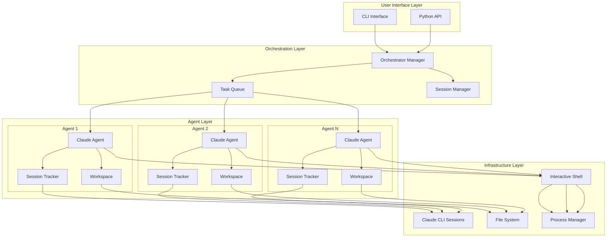

## Component Architecture

### 1. User Interface Layer

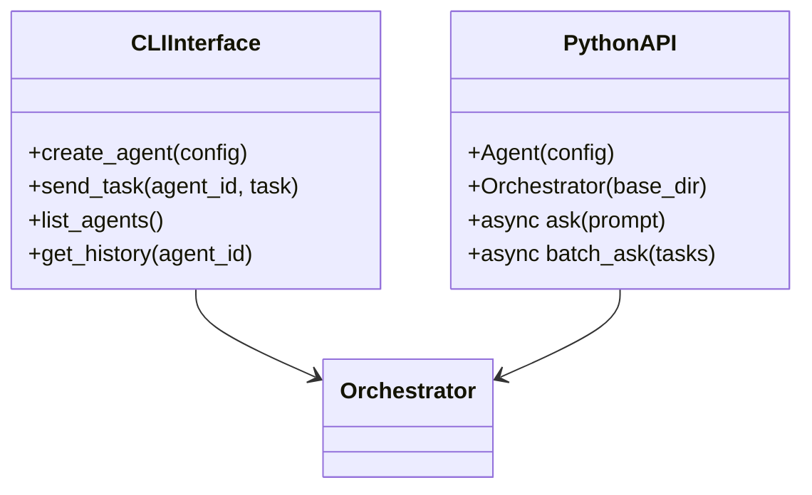

### 2. Orchestration Layer

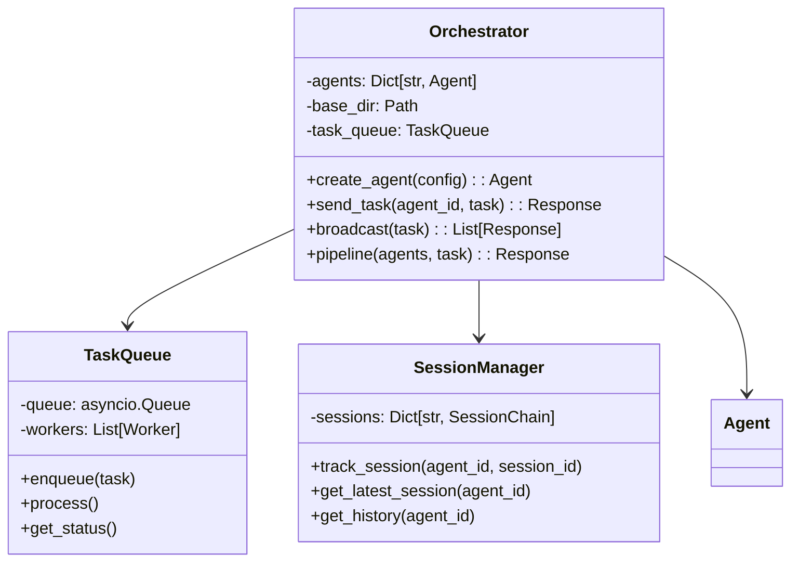

### 3. Agent Layer

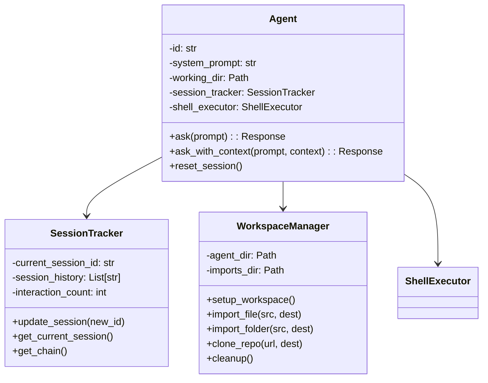

### 4. Infrastructure Layer

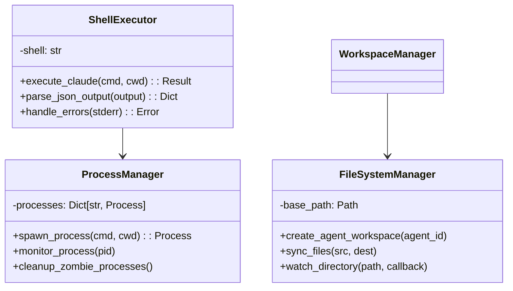

## Data Flow Architecture

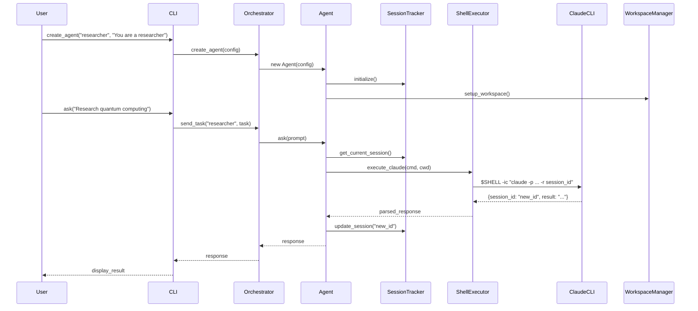

## Session Management Architecture

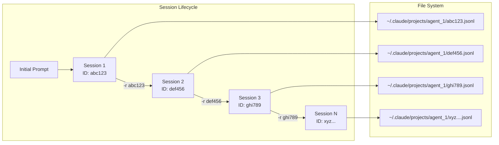

## Communication Patterns

### 1. Sequential Pattern
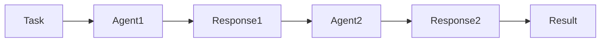

### 2. Parallel Pattern
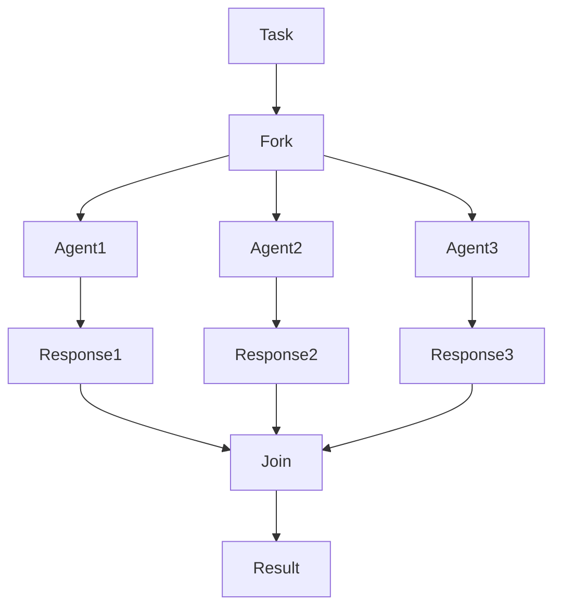

### 3. Pipeline Pattern
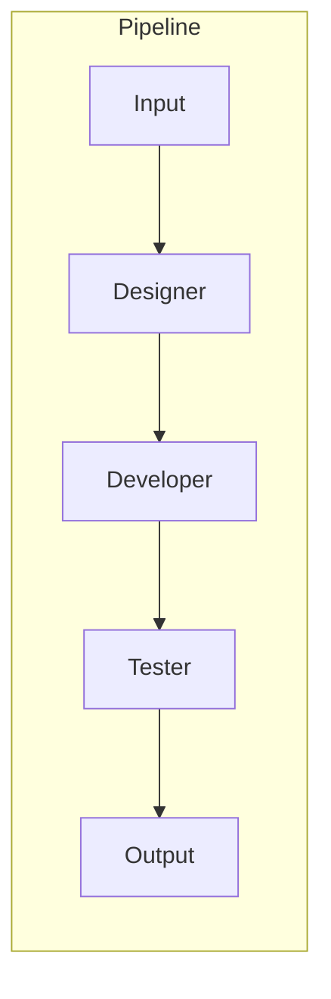

### 4. Hierarchical Pattern
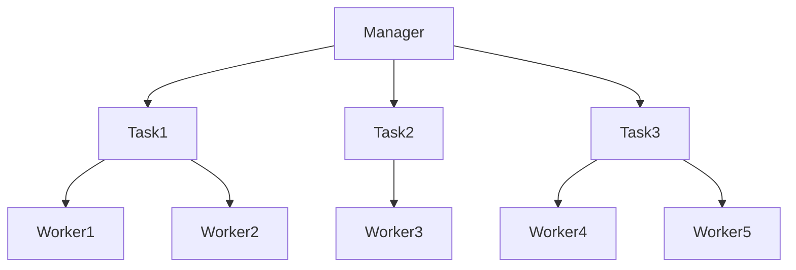

## Error Handling Architecture

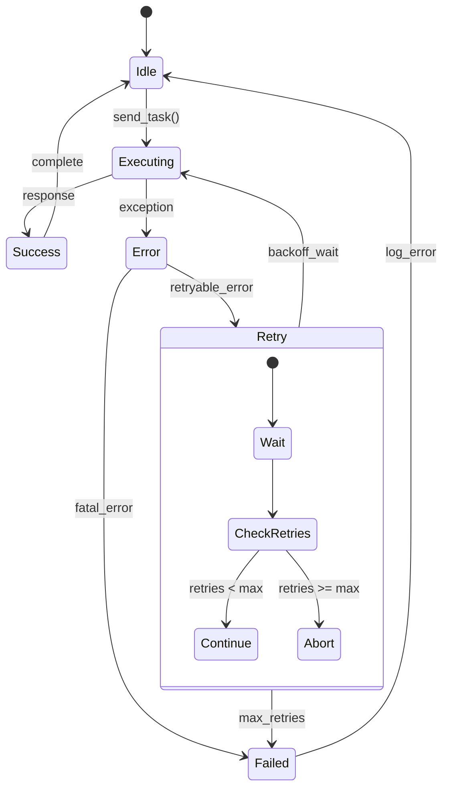

## Deployment Architecture

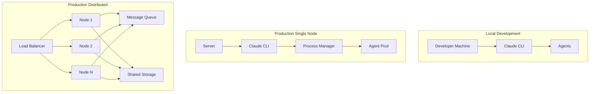

## Security Architecture

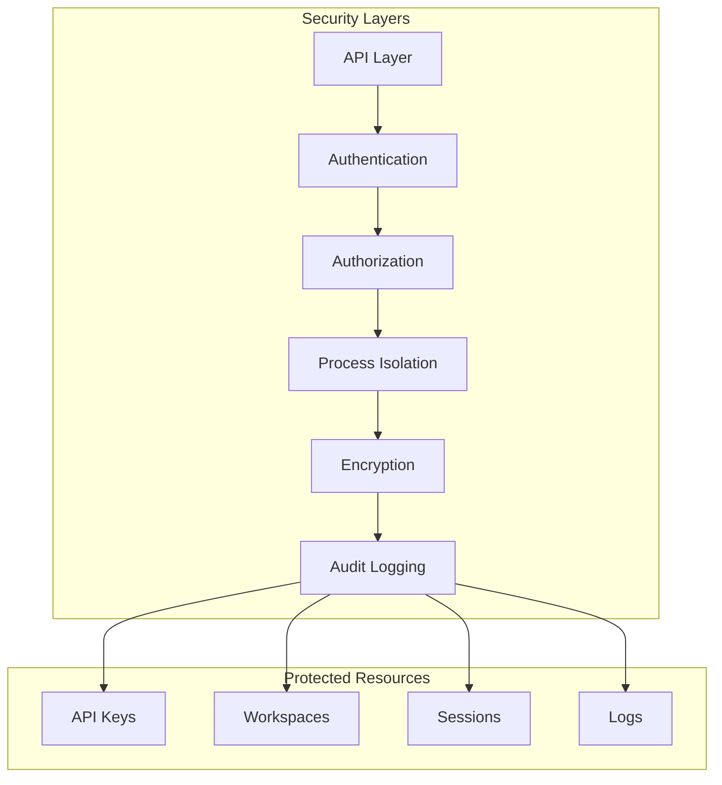

## Key Design Decisions

1. **Interactive Shell Execution**: All Claude CLI calls go through `$SHELL -ic` to ensure proper environment loading
2. **Session Chain Tracking**: Each agent maintains a chain of session IDs for full history
3. **Workspace Isolation**: Each agent operates in its own directory for session persistence
4. **Async Architecture**: Built on asyncio for efficient concurrent agent management
5. **Stateless Agents**: Agents don't maintain internal state; all context is in Claude's sessions
6. **Event-Driven Communication**: Loose coupling between components via events
7. **Fail-Safe Design**: Comprehensive error handling and automatic recovery mechanisms