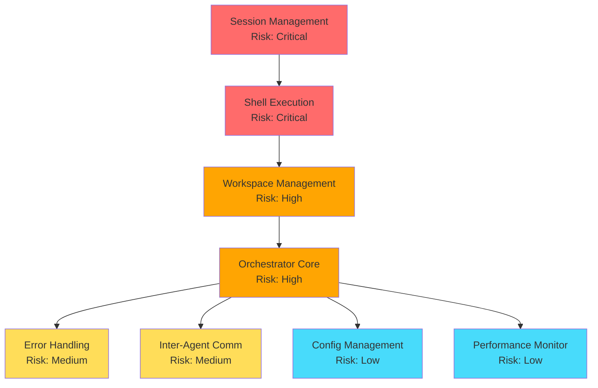

# Key Modules and Critical Success Factors

## Critical Success Factors (Ranked by Impact)

### 1. **Session Management Module** (Impact: 95%)
**Why Critical**: This is THE core differentiator - without proper session management, agents cannot maintain context, making multi-turn conversations impossible.

**Success Factors**:
- Correct invocation via interactive shell (`$SHELL -ic`)
- Accurate session ID tracking and chaining
- Workspace consistency for session persistence
- Error recovery without losing session context

**Architecture Optimization**:
- `SessionTracker` class maintains session chains
- Each agent has dedicated workspace directory
- Automatic session recovery on failures
- Session validation before each interaction

### 2. **Shell Execution Module** (Impact: 90%)
**Why Critical**: All agent interactions depend on proper Claude CLI invocation. A single error here breaks everything.

**Success Factors**:
- Proper shell environment loading
- Clean JSON parsing from mixed output
- Error detection and handling
- Process lifecycle management

**Architecture Optimization**:
- `ShellExecutor` centralizes all CLI interactions
- Output sanitization before JSON parsing
- Comprehensive error categorization
- Process monitoring and cleanup

### 3. **Agent Workspace Management** (Impact: 85%)
**Why Critical**: Session persistence is tied to working directory. Incorrect workspace setup = no memory.

**Success Factors**:
- Consistent directory structure
- Proper file/folder mapping
- Atomic operations for safety
- Resource cleanup

**Architecture Optimization**:
- `WorkspaceManager` ensures directory consistency
- Transactional file operations
- Workspace templates for quick setup
- Automatic cleanup on agent termination

### 4. **Orchestrator Core** (Impact: 80%)
**Why Critical**: Coordinates all agents and manages complex workflows. Poor orchestration = system chaos.

**Success Factors**:
- Efficient task distribution
- Concurrent agent management
- Communication patterns
- Resource optimization

**Architecture Optimization**:
- Async/await for non-blocking operations
- Task queue with priority handling
- Multiple communication patterns (sequential, parallel, pipeline)
- Resource pooling for efficiency

### 5. **Error Handling & Recovery** (Impact: 75%)
**Why Critical**: Claude API has rate limits and occasional failures. Without robust error handling, the system is fragile.

**Success Factors**:
- Graceful degradation
- Automatic retry with backoff
- Session recovery
- Comprehensive logging

**Architecture Optimization**:
- Circuit breaker pattern for API failures
- Exponential backoff with jitter
- Session checkpoint and restore
- Structured logging with correlation IDs

### 6. **Inter-Agent Communication** (Impact: 70%)
**Why Critical**: Complex tasks require agent collaboration. Poor communication = limited capabilities.

**Success Factors**:
- Clear message protocols
- Async message passing
- Result aggregation
- Context preservation

**Architecture Optimization**:
- Event-driven architecture
- Message queue abstractions
- Pipeline and broadcast patterns
- Context injection in prompts

### 7. **Configuration Management** (Impact: 65%)
**Why Critical**: System flexibility depends on easy configuration. Hard-coded values = inflexible system.

**Success Factors**:
- JSON-based agent configs
- Environment variable support
- Hot reload capability
- Validation and defaults

**Architecture Optimization**:
- Hierarchical configuration system
- Schema validation
- Environment-specific overrides
- Configuration templates

### 8. **Performance Monitoring** (Impact: 60%)
**Why Critical**: Can't optimize what you can't measure. Poor monitoring = blind operations.

**Success Factors**:
- Response time tracking
- Token usage monitoring
- Error rate metrics
- Resource utilization

**Architecture Optimization**:
- Metrics collection at all layers
- Real-time dashboards
- Alert thresholds
- Performance baselines

## Module Dependencies and Risk Matrix

## Success Metrics for Each Module

### Session Management
- **Metric**: Session persistence success rate
- **Target**: >99.5%
- **Measurement**: Successful session resumes / Total resume attempts

### Shell Execution
- **Metric**: Command execution success rate
- **Target**: >99%
- **Measurement**: Successful executions / Total executions

### Workspace Management
- **Metric**: Workspace setup time
- **Target**: <500ms
- **Measurement**: Time from request to ready state

### Orchestrator Core
- **Metric**: Task completion rate
- **Target**: >95%
- **Measurement**: Completed tasks / Total submitted tasks

### Error Handling
- **Metric**: Recovery success rate
- **Target**: >90%
- **Measurement**: Successful recoveries / Total errors

### Inter-Agent Communication
- **Metric**: Message delivery rate
- **Target**: >99.9%
- **Measurement**: Delivered messages / Total sent messages

### Configuration Management
- **Metric**: Configuration load time
- **Target**: <100ms
- **Measurement**: Time to parse and validate config

### Performance Monitoring
- **Metric**: Metric collection overhead
- **Target**: <1% CPU
- **Measurement**: CPU usage with/without monitoring

## Architecture Justification for Success Factors

### 1. **Modular Design**
- Each critical module is independent
- Failures are isolated
- Easy to test and debug
- Can be optimized independently

### 2. **Fail-Safe Defaults**
- Conservative retry policies
- Automatic session recovery
- Graceful degradation
- Circuit breakers for external calls

### 3. **Performance First**
- Async everywhere possible
- Resource pooling
- Lazy loading
- Caching where appropriate

### 4. **Observable System**
- Metrics at every layer
- Structured logging
- Distributed tracing
- Health checks

### 5. **Developer Experience**
- Simple APIs
- Clear error messages
- Comprehensive documentation
- Example-driven design

## Risk Mitigation Strategies

### High-Risk Modules (Session & Shell)
- Extensive unit testing
- Integration test suite
- Fallback mechanisms
- Manual override options

### Medium-Risk Modules (Workspace & Orchestrator)
- Automated testing
- Canary deployments
- Feature flags
- Rollback procedures

### Low-Risk Modules (Config & Monitoring)
- Standard testing
- Gradual rollout
- Documentation
- Community feedback

## Conclusion

The architecture is specifically optimized for the critical success factors:

1. **Session Management** is the heart - everything else supports it
2. **Shell Execution** is the foundation - must be rock-solid
3. **Workspace Management** enables persistence - must be consistent
4. **Orchestrator** brings it together - must be efficient
5. **Error Handling** keeps it running - must be comprehensive

By focusing on these key modules in priority order, we maximize the chance of building a successful multi-agent system that actually works in production.