# Risk Analysis and Mitigation Strategies

## Critical Risks (Showstoppers)

### 1. **Session Management Failure** 
**Risk Level**: 🔴 CRITICAL  
**Probability**: Medium (30%)  
**Impact**: System Failure

**Description**: If session management doesn't work correctly, agents lose all context between interactions, making the system useless for multi-turn conversations.

**Root Causes**:
- Incorrect shell invocation (not using interactive mode)
- Working directory inconsistency
- Session file corruption
- Claude CLI updates breaking compatibility

**Mitigation**:
- Extensive testing of session chains
- Version pinning for Claude CLI
- Session validation before each use
- Backup context injection as fallback
- Monitoring session success rates

### 2. **Interactive Shell Dependency**
**Risk Level**: 🔴 CRITICAL  
**Probability**: Medium (25%)  
**Impact**: Cross-platform Failure

**Description**: System requires `$SHELL -ic` which may not work consistently across different shells and platforms.

**Root Causes**:
- Shell-specific configurations (aliases/functions)
- Platform differences (macOS vs Linux)
- Environment variable inconsistencies
- Docker/container limitations

**Mitigation**:
- Shell detection and adaptation
- Fallback to direct CLI invocation
- Comprehensive shell compatibility testing
- Clear documentation of requirements
- Docker base images with known-good configs

## High Risks

### 3. **Rate Limiting and API Quotas**
**Risk Level**: 🟠 HIGH  
**Probability**: High (60%)  
**Impact**: Degraded Performance

**Description**: Claude has strict rate limits (800 prompts/day). Multi-agent systems can quickly exhaust quotas.

**Root Causes**:
- No built-in rate limiting
- Parallel agents consuming quota
- Retry logic amplifying usage
- No quota monitoring

**Mitigation**:
- Implement token bucket rate limiter
- Agent pooling with queue
- Exponential backoff on 429s
- Real-time quota monitoring
- Graceful degradation strategies

### 4. **Resource Exhaustion**
**Risk Level**: 🟠 HIGH  
**Probability**: Medium (40%)  
**Impact**: System Crash

**Description**: Each agent spawns processes and creates files. Unchecked growth can exhaust system resources.

**Root Causes**:
- Zombie processes from crashed agents
- Accumulating session files
- Memory leaks in long-running agents
- Unbounded agent creation

**Mitigation**:
- Process lifecycle management
- Automatic cleanup routines
- Resource limits per agent
- Agent pool with max size
- Health checks and auto-restart

### 5. **JSON Parsing Brittleness**
**Risk Level**: 🟠 HIGH  
**Probability**: Medium (35%)  
**Impact**: Communication Failure

**Description**: Claude CLI output mixes shell output with JSON, making parsing fragile.

**Root Causes**:
- Shell login messages
- Warning/error messages
- Malformed JSON responses
- Unicode handling issues

**Mitigation**:
- Robust output sanitization
- Multiple parsing strategies
- Fallback text extraction
- Output format validation
- Comprehensive error messages

## Medium Risks

### 6. **Workspace Conflicts**
**Risk Level**: 🟡 MEDIUM  
**Probability**: Medium (30%)  
**Impact**: Data Corruption

**Description**: Multiple agents or concurrent operations might conflict when accessing shared resources.

**Root Causes**:
- Race conditions in file operations
- Shared workspace access
- Non-atomic operations
- Missing file locks

**Mitigation**:
- Strict workspace isolation
- Atomic file operations
- File locking mechanisms
- Transaction-like workflows
- Conflict resolution strategies

### 7. **Complex Orchestration Logic**
**Risk Level**: 🟡 MEDIUM  
**Probability**: High (50%)  
**Impact**: Maintenance Burden

**Description**: Orchestration patterns can become complex and hard to debug.

**Root Causes**:
- Implicit dependencies
- Complex state machines
- Nested agent calls
- Circular dependencies

**Mitigation**:
- Simple, composable patterns
- Clear dependency graphs
- Comprehensive logging
- Visual workflow tools
- Strict architectural rules

### 8. **Security Vulnerabilities**
**Risk Level**: 🟡 MEDIUM  
**Probability**: Low (20%)  
**Impact**: Data Breach

**Description**: Agents with file system access could potentially access sensitive data.

**Root Causes**:
- Unrestricted file access
- API key exposure
- Command injection
- Path traversal

**Mitigation**:
- Sandboxed environments
- Strict permission models
- Input sanitization
- API key encryption
- Security audit trails

## Low Risks

### 9. **Performance Degradation**
**Risk Level**: 🟢 LOW  
**Probability**: Medium (40%)  
**Impact**: User Experience

**Description**: System might become slow with many agents or complex workflows.

**Root Causes**:
- Synchronous operations
- Inefficient algorithms
- Network latency
- Large context windows

**Mitigation**:
- Async/await everywhere
- Performance profiling
- Caching strategies
- Load balancing
- Performance budgets

### 10. **Documentation Drift**
**Risk Level**: 🟢 LOW  
**Probability**: High (70%)  
**Impact**: Developer Confusion

**Description**: Documentation becomes outdated as system evolves.

**Root Causes**:
- Rapid development
- Multiple contributors
- Complex system
- No doc validation

**Mitigation**:
- Doc-driven development
- Automated doc generation
- Regular doc reviews
- Example validation
- User feedback loops

## Risk Matrix

```mermaid
graph LR
    subgraph "Impact vs Probability"
        A[Session Failure<br/>High Impact, Med Prob]
        B[Shell Dependency<br/>High Impact, Med Prob]
        C[Rate Limits<br/>Med Impact, High Prob]
        D[Resource Exhaust<br/>High Impact, Med Prob]
        E[JSON Parsing<br/>Med Impact, Med Prob]
        F[Workspace Conflicts<br/>Med Impact, Med Prob]
        G[Complex Logic<br/>Low Impact, High Prob]
        H[Security<br/>High Impact, Low Prob]
        I[Performance<br/>Low Impact, Med Prob]
        J[Doc Drift<br/>Low Impact, High Prob]
    end
    
    style A fill:#ff6b6b
    style B fill:#ff6b6b
    style C fill:#ffa502
    style D fill:#ffa502
    style E fill:#ffa502
    style F fill:#ffdd59
    style G fill:#ffdd59
    style H fill:#ffdd59
    style I fill:#48dbfb
    style J fill:#48dbfb
```

## Assumptions Being Made

### Technical Assumptions
1. Claude CLI will maintain backward compatibility
2. Session files will remain in JSONL format
3. Interactive shell is available on target systems
4. File system has sufficient IOPS for session management
5. Python asyncio is sufficient for concurrency needs

### Operational Assumptions
1. Users understand Claude's rate limits
2. System has dedicated resources (not shared)
3. Regular maintenance windows are acceptable
4. Users will follow security best practices
5. Error messages are acted upon

### Business Assumptions
1. Claude API pricing remains stable
2. Session persistence is a must-have feature
3. Multi-agent coordination provides value
4. Complexity is justified by capabilities
5. Open-source approach is acceptable

## Risk Mitigation Timeline

### Pre-Launch (Highest Priority)
- [ ] Session management testing
- [ ] Shell compatibility matrix
- [ ] Rate limiter implementation
- [ ] Security audit
- [ ] Load testing

### Launch Phase
- [ ] Monitor session success rates
- [ ] Track resource usage
- [ ] Gather error patterns
- [ ] User feedback collection
- [ ] Performance baselines

### Post-Launch
- [ ] Optimize based on metrics
- [ ] Add advanced features
- [ ] Scale testing
- [ ] Security updates
- [ ] Documentation updates

## Contingency Plans

### If Session Management Fails
1. Implement custom context management
2. Use conversation templates
3. Limit to single-turn interactions
4. Switch to API-based approach

### If Rate Limits Hit
1. Queue with priority system
2. Batch similar requests
3. Cache common responses
4. Implement quota sharing
5. Notify users of delays

### If Performance Degrades
1. Reduce concurrent agents
2. Implement caching layers
3. Optimize prompts
4. Use smaller models
5. Scale horizontally

## Conclusion

The primary risks center around:
1. **Session Management** - Our core feature
2. **Shell Dependencies** - Our execution model
3. **Rate Limits** - Our scaling constraint

The architecture addresses these through:
- Robust error handling and fallbacks
- Comprehensive monitoring
- Clear architectural boundaries
- Incremental deployment strategy

Success requires:
- Extensive testing before launch
- Careful monitoring during operation
- Quick response to issues
- Regular system evolution